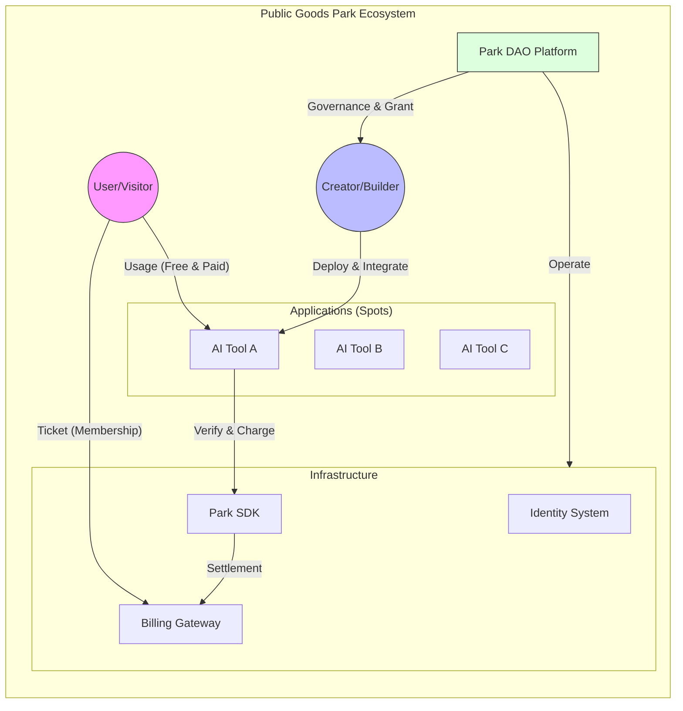

# 01. Vision Overview

> "AI 释放了创造力。在未来，想象力、创造力和情感，是人类最宝贵的。"
> "请使用你的创造力，来构建你想要的数字未来，而不是被数字巨头所控制。"

**Public Good Park (公共物品公园)** 是一个为 AI 时代的各种“创造者 (Cre-Builder)”提供的开源公园。如果你有想法、有创造力，并使用 AI 构建了工具，这里就是你展示和获益的地方。

## 🌟 核心理念 (Core Philosophy)

在 AI 的加速下，代码能力不再是瓶颈。**Public Good Park** 旨在解决以下痛点：
1.  **对于创作者**：解决推广难、收费系统复杂、缺乏早期用户的问题。释放纯粹的创造力。
2.  **对于用户**：解决“订阅疲劳”和寻找优质工具难的问题。提供海量优质、经过筛选的公共物品。
3.  **对于社会**：防止“公地悲剧”，通过合理的门票和增量付费机制，维持生态的可持续性。

## 🏗️ 架构概览 (Architecture Overview)

Public Good Park 就像一个真实的公园，有围墙（门票）、景点（应用）和基础设施（水电/SDK）。

## 💡 为什么选择 Park?

| 传统模式 | Park 模式 |
| :--- | :--- |
| **孤岛式应用**：每个 App 都要注册、付费 | **一票通**：一个 ID，一张门票，畅玩所有 App |
| **高昂推广成本**：开发者自己找流量 | **自带流量**：公园自带游客，精准分发 |
| **容易烂尾**：个人开发者精力有限 | **生态托底**：DAO 提供 基础设施、Grant、运营支持等社区服务 |

## 🚀 我们的使命
人类数字未来不应该是巨头垄断平台下的被剥削的数据劳工，而是百花齐放的创新者的花园。
构建一个 **AI 原生的数字合作社**， 构建公共物品花园，简称公园，Park。
通过**代码（SDK）**和**协议（License）**，将用户、创作者和平台的复杂博弈关系简化为自动化的流程，让创造力自由流淌。
