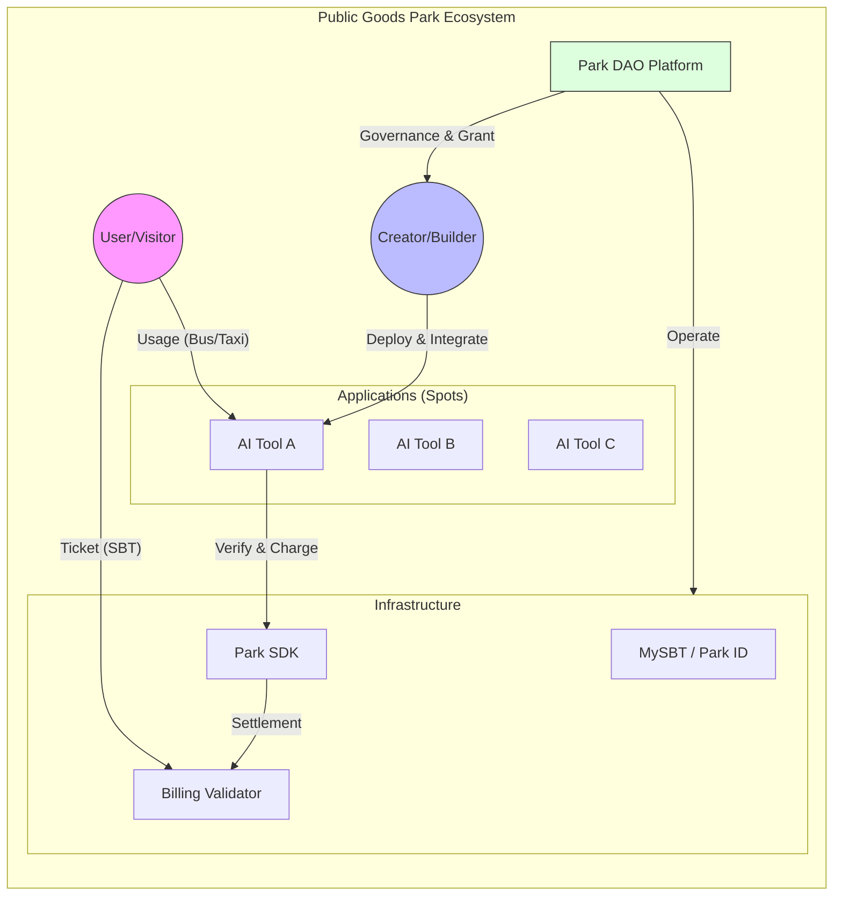

# 01. Vision Overview

> "AI 释放了创造力。在未来，想象力、创造力和情感，是人类最宝贵的。"
> "请用你的创造力，来构建你想要的数字未来，而不是被数字巨头所控制。"

**Public Good Park (公共物品公园)** 是一个为 AI 时代的各种“创造者 (Creator/Builder)”提供的开源公园。如果你有想法、有创造力，并使用 AI 构建了工具，这里就是你展示和获益的地方。

## 🌟 核心理念 (Core Philosophy)

### 1. 反“数字劳工” (Anti-Digital Labor)
在旧的平台经济中，用户和创作者往往沦为被算法控制的“数字劳工”，贡献数据却被巨头剥削。
**Park 的愿景**是建立一个属于创新者的花园。
*   **AI 作为杠杆**：写代码的能力不再是壁垒，想象力才是核心。
*   **去中心化归属**：应用和数据的权益归属于创作者和用户，而非平台。

### 2. 公交车与出租车理论 (The Bus & Taxi Model)
我们如何平衡“公共性”与“商业性”？Park 采用独特的双层服务模型：

*   **🚌 公交车 (The Bus) - 公共物品 (Public Goods)**
    *   **从哪来**：创作者提供的基础功能。
    *   **谁付费**：用户支付极低的“门票”费用（如 2 元/次）。
    *   **特点**：覆盖基础需求，普惠，防止“搭便车”和滥用。门票收入维持公园运营维系。
*   **🚕 出租车 (The Taxi) - 增量服务 (Incremental Services)**
    *   **从哪来**：创作者提供的需高算力、定制化或更急迫的高级功能（如“我想坐空调车”、“我要更快”）。
    *   **谁付费**：用户按需支付增量费用（如 3.5 元或更高）。
    *   **特点**：满足个性化、高质量需求。**这是创作者的主要收入来源。**

## 🏗️ 架构概览 (Architecture Overview)

Public Good Park 就像一个真实的公园，有围墙（门票/SBT）、景点（应用）和基础设施（水电/SDK）。

## 💡 为什么选择 Park?

| 维度 | 传统 App Store / SaaS | Park (公共物品花园) |
| :--- | :--- | :--- |
| **准入** | 注册繁琐，每个 App 都要付费 | **SBT 一票通**：一个 Park ID，畅玩所有 App (公交车模式) |
| **推广** | 开发者自己投流，获客成本高 | **自带流量**：公园自带游客，AI 算法精准分发 |
| **生态** | 赢家通吃，只有头部能活 | **百花齐放**：长尾需求也能通过“出租车模式”获利 |
| **保障** | 容易烂尾，服务无保障 | **生态托底**：DAO 提供基础设施、Grant、运营支持等社区服务 |

## 🚀 我们的使命
人类数字未来不应该是巨头垄断平台下的被剥削的数据劳工，而是百花齐放的创新者的花园。
构建一个 **AI 原生的数字合作社**， 构建公共物品花园，简称公园，Park。
通过**代码（SDK）**和**协议（License）**，将用户、创作者和平台的复杂博弈关系简化为自动化的流程，让创造力自由流淌。
