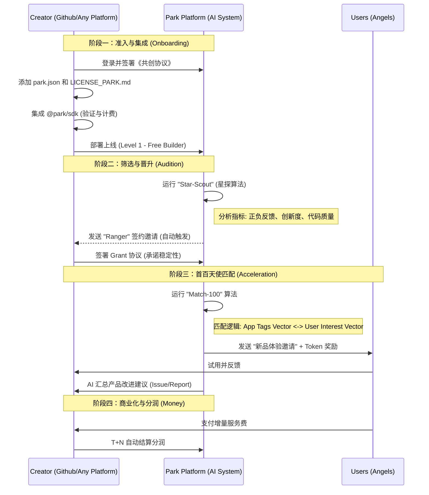

# 03. Lifecycle Workflows (全生命周期流程)

本文档通过流程图详细说明了创作者和用户在生态中的关键交互过程，包含核心算法逻辑和争议解决机制。

## 🛠️ 创作者旅程 (Creator Journey) & 🚀 首百天使匹配算法

从一个 Idea 到成为 Park 签约项目，并获得第一批 100 个精准用户的全过程。



### 🧠 Match-100 算法逻辑
1.  **Tag Extraction**: AI 扫描应用描述和代码，提取标签（如 `AI`, `Image`, `Anime`, `Fast`）。
2.  **User Profiling**: 基于用户历史行为（使用的 App、停留时长、付费意愿）构建兴趣向量。
3.  **Vector Search**: 计算余弦相似度，筛选出 Top 100 最可能感兴趣且活跃度高的“天使用户”。
4.  **Incentive**: 系统自动发放小额 G Token 作为试用奖励。

---

## 🎫 用户旅程 (User Journey) & ⚖️ 争议解决

游客如何入园、消费、处理纠纷及退出的流程。

```mermaid
graph LR
    subgraph "Entry (入园)"
        A[访问官网] --> B{购买门票?}
        B -- Yes --> C[支付押金/年费]
        C --> D[获得 Park ID/一票通]
    end

    subgraph "Usage (游玩)"
        D --> E[使用 App A /免费额度内]
        D --> F[使用 App B /增量高级功能]
        F --> G{确认支付?}
        G -- Yes --> H[扣除余额]
        G -- No --> E
    end

    subgraph "Dispute (争议)"
        H --> I{结果满意?}
        I -- No (Error/Bad Quality) --> J[发起申诉]
        J --> K{AI 自动判定}
        K -- System Error (5xx) --> L[秒级退款]
        K -- Subjective --> M[社区仲裁庭 (Jury)]
        M --> N{投票结果}
        N -- Win --> L
        N -- Lose --> O[维持原判]
    end

    subgraph "Exit (退园)"
        P[申请退票] --> Q{计算退款}
        Q --> R[初始费 - 已用管理费 - 未结清算 - 手续费]
        R --> S[退还剩余资金]
    end
```

## 🛡️ 治理与退出 (Governance & Succession)

针对项目烂尾或创作者退出的应急机制。

1.  **主动退出**：开发者在 `park.json` 标记 `deprecated`。平台给予 30 天缓冲期通知用户。
2.  **社区接管 (针对签约项目)**：
    *   触发条件：主要维护者失联或严重违反 SLA，且应用仍有大量活跃用户。
    *   执行：DAO 启动代码分叉或接管程序（基于 **Grant 协议** 中的托管条款）。
    *   权益：原作者保留部分永久荣誉分润，管理权移交新维护者。
