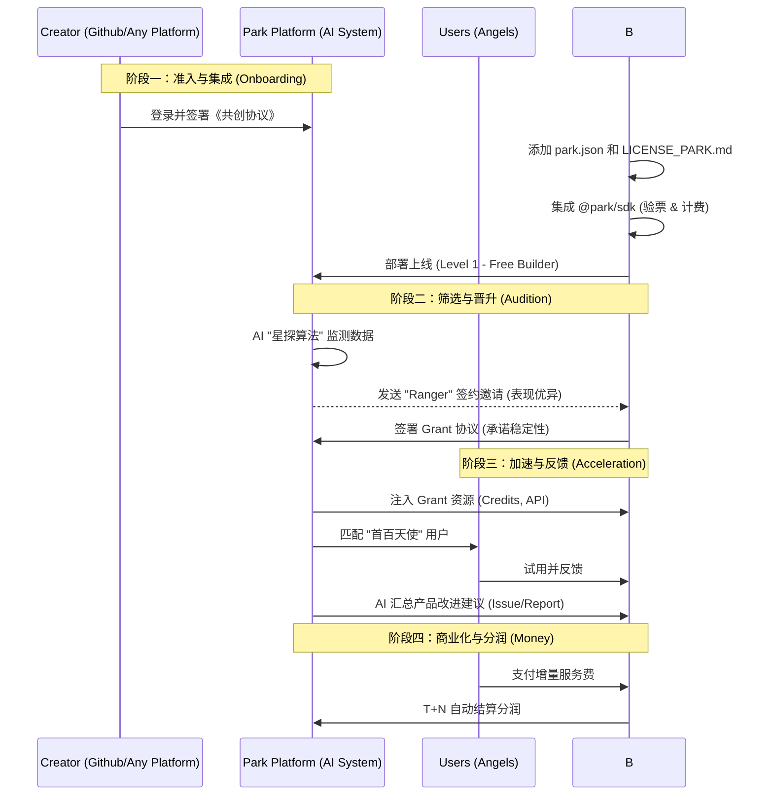
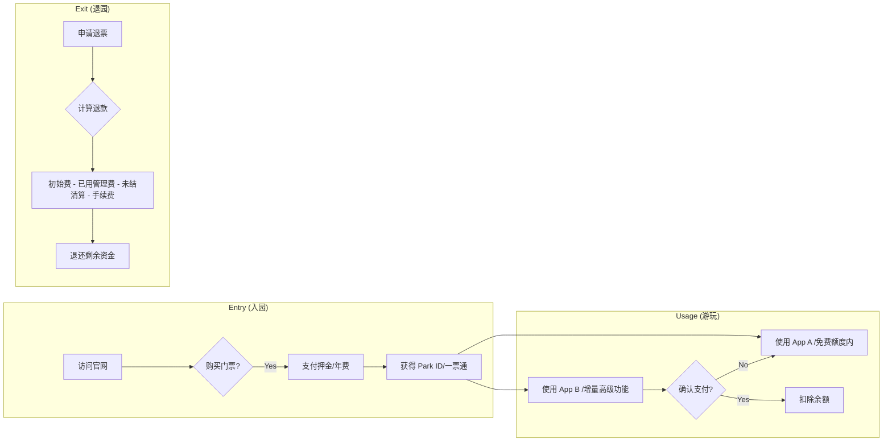

# 03. Lifecycle Workflows (全生命周期流程)

本文档通过流程图详细说明了创作者和用户在生态中的关键交互过程。

## 🛠️ 创作者旅程 (Creator Journey)

从一个 Idea 到成为 Park 签约项目的全过程。

## 🎫 用户旅程 (User Journey)

游客如何入园、消费及退出的流程。

## ⚖️ 治理与退出 (Governance & Succession)

针对项目烂尾或创作者退出的应急机制。

1.  **主动退出**：开发者在 `park.json` 标记 `deprecated`。平台给予 30 天缓冲期通知用户。
2.  **社区接管 (针对签约项目)**：
    *   触发条件：主要维护者失联或严重违反 SLA，且应用仍有大量活跃用户。
    *   执行：DAO 启动代码分叉或接管程序（基于 Grant 协议中的托管条款）。
    *   权益：原作者保留部分永久荣誉分润，管理权移交新维护者。
